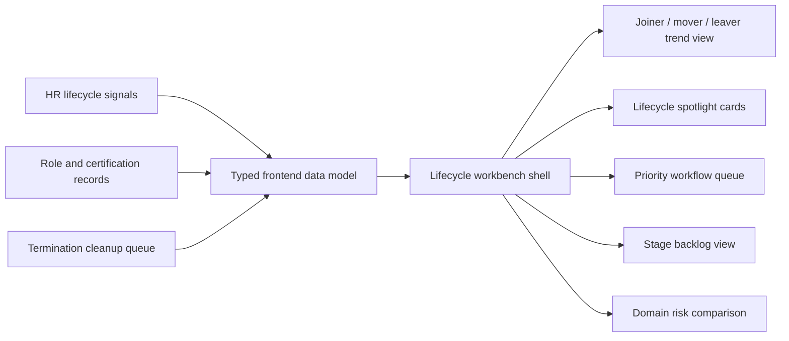
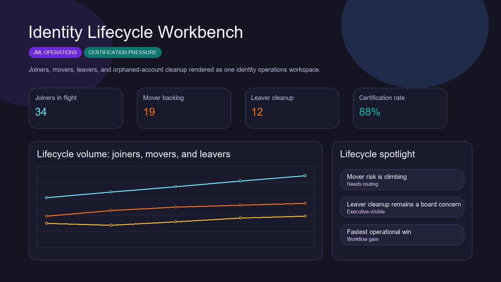
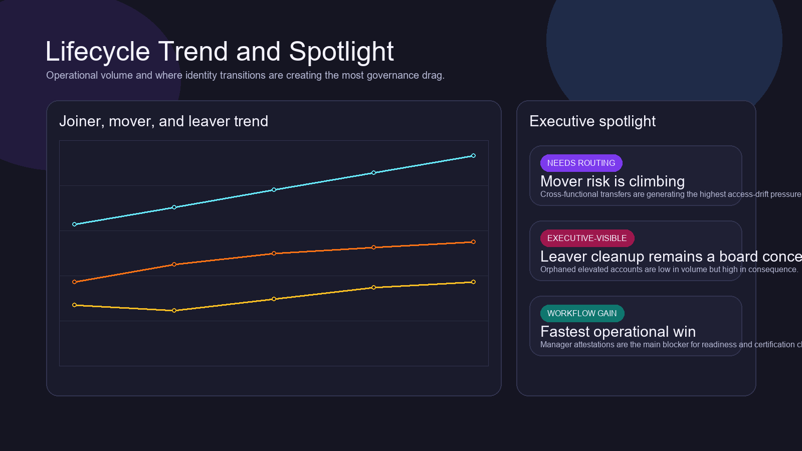
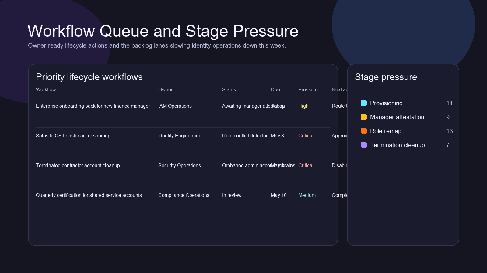
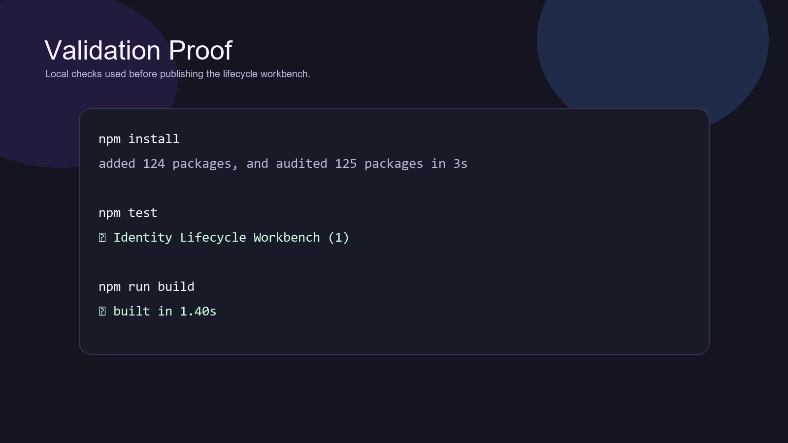

# Identity Lifecycle Workbench

> **React + TypeScript portfolio project** demonstrating joiner-mover-leaver workflows, onboarding readiness, transfer access drift, orphaned-account cleanup, certification pressure, and operator-facing identity governance UX.

**Recruiter takeaway:** *"This person understands identity lifecycle operations as a workflow and governance product, not just an access checklist."*

---

## Project Overview

| Attribute | Detail |
|---|---|
| **Frontend Stack** | React 19 + Vite + TypeScript |
| **Domain** | Identity lifecycle operations and governance |
| **Audience** | IAM, security, compliance, platform operations, people systems stakeholders |
| **Signal Areas** | Joiner readiness · mover drift · leaver cleanup · certification debt |
| **Portfolio Role** | Frontend proof of identity-lifecycle workflow design |
| **Validation** | Vitest + Testing Library |

---

## Executive Summary

Identity Lifecycle Workbench is a recruiter-ready frontend project built to feel like a real internal workspace for joiner, mover, and leaver operations. Instead of reducing lifecycle governance to one-off tickets and access spreadsheets, it creates an operator surface for onboarding readiness, transfer remediation, orphaned-account cleanup, and certification backlog visibility.

This repo exists to show that identity work is not only about access controls. It is also about workflow coordination, timing, ownership, and reducing operational drag across the organization.

---

## Business Problem

Identity lifecycle work breaks down when provisioning, transfers, and offboarding are handled as disconnected tasks. The result is familiar:

- joiners arrive without the right access packages
- movers carry old entitlements into new roles
- leaver cleanup leaves behind orphaned or elevated accounts
- certification backlogs hide exposure until review season becomes painful

Teams need one place to see where lifecycle pressure is growing and what needs immediate action.

---

## Solution

This project reframes identity lifecycle governance as an operator-grade product surface for:

- onboarding and access-package readiness
- transfer and role-remap visibility
- termination and orphaned-account cleanup
- certification and attestation progress
- executive-readable lifecycle posture

---

## Architecture



### Workspace Flow

1. Operators land on one lifecycle posture surface.
2. Trend and spotlight views show where identity operations are straining.
3. The queue clarifies which workflows require the next owner action.
4. Stage backlog surfaces where provisioning, attestation, or cleanup is slowing down.
5. Domain comparison exposes where overdue reviews and orphaned accounts are concentrating.

---

## Screenshots

### Hero Capture



### Lifecycle Trend and Spotlight



### Workflow Queue and Stage Pressure



### Validation Proof



---

## Key Design Decisions

| Decision | Rationale |
|---|---|
| **Lifecycle-workbench framing** | Makes the repo feel like a real operator system instead of a static access tracker |
| **Joiner / mover / leaver separation** | Highlights how each lifecycle path creates different governance and timing problems |
| **Static data model** | Keeps the repo simple to run while preserving product realism |
| **Distinct lifecycle visual theme** | Gives this repo a separate identity from security posture and compliance products |
| **Queue + backlog emphasis** | Focuses attention on ownership and timing instead of passive reporting |

---

## What An Engineering Leader Sees Here

- frontend execution grounded in identity and governance workflow reality
- product thinking around lifecycle operations, not just dashboards
- internal-tool UX that supports security and people-systems coordination
- broader portfolio credibility across revenue, platform, identity, and compliance systems

---

## Getting Started

### Prerequisites

- Node.js 20+
- npm

### Setup

```bash
git clone https://github.com/mizcausevic-dev/identity-lifecycle-workbench.git
cd identity-lifecycle-workbench
npm install
cp .env.example .env
npm run dev
```

Open:

- `http://localhost:5173`

### Run Tests

```bash
npm test
```

### Build

```bash
npm run build
```

---

## What This Demonstrates

- identity lifecycle workflow understanding
- governance-aware frontend systems design
- certification and offboarding risk translated into product structure
- React + TypeScript delivery with production-minded repo hygiene
- portfolio breadth beyond generic security and admin interfaces

---

## Future Enhancements

- manager-level attestation drilldowns
- role-template diffing for internal transfers
- ticket and identity-provider integrations
- evidence export for audit and compliance teams
- forecast views for lifecycle queue pressure

---

## Tech Stack

[](https://react.dev/)
[](https://vite.dev/)
[](https://www.typescriptlang.org/)
[](https://recharts.org/en-US/)
[](https://vitest.dev/)
[](https://opensource.org/license/mit)

### Portfolio Links

- [LinkedIn](https://www.linkedin.com/in/mirzacausevic)
- [Skills Page](https://mizcausevic.com/skills/)
- [Medium](https://medium.com/@mizcausevic)
- [GitHub](https://github.com/mizcausevic-dev)

---

*Part of [mizcausevic-dev's GitHub portfolio](https://github.com/mizcausevic-dev) — demonstrating identity lifecycle workflow thinking, operator-facing governance UX, and control-plane product execution.*
