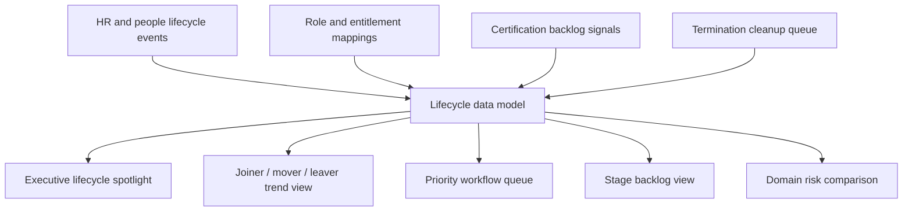

# Identity Lifecycle Workbench Architecture

## Intent

Identity Lifecycle Workbench is a frontend-first internal tool concept for turning joiner, mover, and leaver work into one coordinated operating surface.

The product is designed to make lifecycle pressure visible before it turns into orphaned access, delayed onboarding, or certification chaos.

## System Flow

## Product Surfaces

- **Lifecycle trend view**: shows operational volume and drift across joiners, movers, and leavers
- **Spotlight cards**: summarize where leadership should care now
- **Priority queue**: clarifies the next owner action on high-pressure workflows
- **Stage backlog view**: reveals where provisioning, attestation, or cleanup is stalling
- **Domain comparison**: highlights overdue reviews and orphaned accounts by operating area

## Why This Matters

This repo exists to show that identity governance is deeply operational:

- it depends on timing
- it depends on ownership
- it depends on coordination across HR, security, platform, and business teams

That makes it a stronger portfolio signal than a generic access admin interface.
